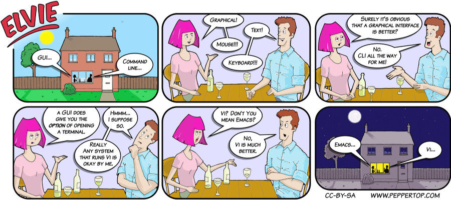

Elvie #003
==========
This Elvie strip appeared in issue #3 of 'Linux Voice' magazine, which included an article on command line vs graphical interfaces.

File Details
------------
* 003_panel_1.ora            - The original MyPaint image used for panels 1
* 003_panel_2-5.ora          - The original MyPaint image used for panels 2-5, using separate layers
* 003_panel_6.ora            - The original MyPaint image used for panels 6
* 003_panel_n.png            - A PNG image, exported from an ORA file using The GIMP, for the main drawing in panel "n".
* Elvie_003.svg              - The Inkscape SVG file that combines the panel images with frames and text to create the comic.
* Elvie_003_en-GB.jpg        - A PNG export of the final Inkscape file, converted to JPEG format for use on our website (British English)

