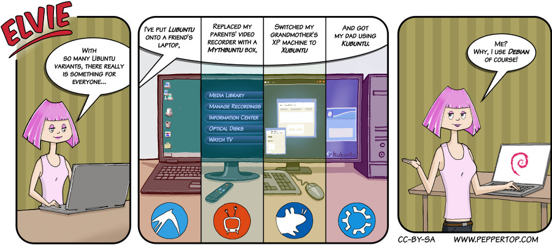

Elvie #004
==========
This Elvie strip appeared in issue #4 of 'Linux Voice' magazine, which included an article on Ubuntu remixes.

File Details
------------
* 004_panel_n.ora            - The original MyPaint image used for panel "n"
* 004_panel_n.png            - A PNG image, exported from an ORA file using The GIMP, for the main drawing in panel "n".
* 004_panel_2_*buntu.png     - Representations of logos, extracted from 004_panel_2.ora for easier placement.
* Elvie_004.svg              - The Inkscape SVG file that combines the panel images with frames and text to create the comic.
* Elvie_004_en-GB.jpg        - A PNG export of the final Inkscape file, converted to JPEG format for use on our website (British English)

