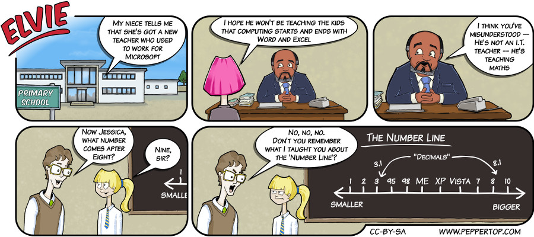

Elvie #010
==========
This strip appeared in issue #10 of Linux Voice magazine, which featured an article about Linux vs Windows
and came out shortly after Microsoft announced that the next release of their operating system
(following Windows 8 & 8.1) would be called Windows 10.

File Details
------------
* 010_panel_n.ora            - The original MyPaint image used for panel "n".
* 010_panel_n.png            - A PNG image, exported from an ORA file using The GIMP, for the main drawing in panel "n".
* Elvie_010.svg              - The Inkscape SVG file that combines the panel images with frames and text to create the comic.
* Elvie_010_en-GB.jpg        - A PNG export of the final Inkscape file, converted to JPEG format for use on our website (British English).

