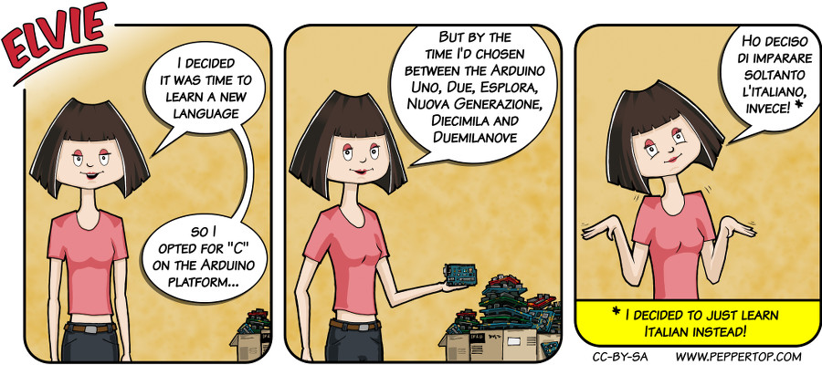

Elvie #012
==========
This strip appeared in issue #12 of Linux Voice magazine, which featured an article about
writing a hardware driver for the Arduino platform.

File Details
------------
* 012_panels_1-3.ora         - The original MyPaint images used for the panels. The three images are on different pairs of layers (outline & colours).
* 012_panel_n.png            - A PNG image, exported from the ORA file using The GIMP, for the main drawing in panel "n".
* 012_background.png         - A PNG image exported from the ORA file using The GIMP, used for the background in each panel.
* 012_boxes.png              - A PNG image exported from the ORA file using The GIMP, used for the TV/monitor in each panel.
* Elvie_012.svg              - The Inkscape SVG file that combines the panel images with frames and text to create the comic.
* Elvie_012_en-GB.jpg        - A PNG export of the final Inkscape file, converted to JPEG format for use on our website (British English).

