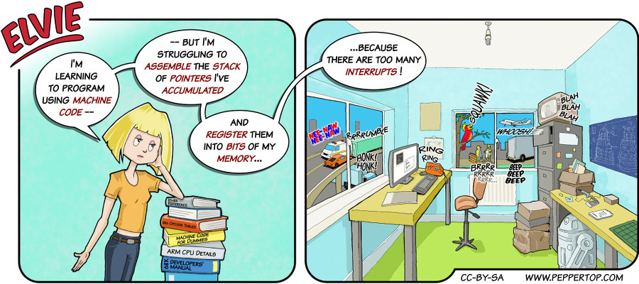

Elvie #013
==========
This strip appeared in issue #13 of Linux Voice magazine, which included the first
article in a series about assembly language programming.

File Details
------------
* 013_panel_n.ora         - The original MyPaint images used for the panels. The three images are on different pairs of layers (outline & colours).
* 013_panel_n.png         - A PNG image, exported from the ORA file using The GIMP, for the main drawing in panel "n".
* 013_background.png      - A PNG image exported from the ORA file using The GIMP, used for the background in each panel.
* Elvie_013.svg           - The Inkscape SVG file that combines the panel images with frames and text to create the comic.
* Elvie_013_en-GB.jpg     - A PNG export of the final Inkscape file, converted to JPEG format for use on our website (British English).

