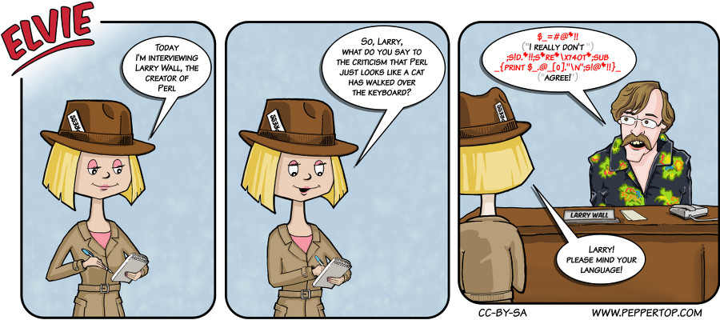

Elvie #015
==========
This strip appeared in issue #15 of Linux Voice magazine, which included an interview with Larry Wall.

File Details
------------
* 015_panel_n.ora             - The original MyPaint images used for the panels.
* 015_panel_n.png             - A PNG image, exported from the ORA file using The GIMP, for the main drawing in panel "n".
* 015_panel_3_desk.png        - A PNG image, exported from the ORA file using The GIMP, for the desk in panel 3.
* 015_panel_3_Larry_Wall.png  - A PNG image, exported from the ORA file using The GIMP, for the Larry Wall caricature in panel 3.
* 015_background.png          - A PNG image used for the background in each panel.
* Elvie_015.svg               - The Inkscape SVG file that combines the panel images with frames and text to create the comic.
* Elvie_015_en-GB.jpg         - A PNG export of the final Inkscape file, converted to JPEG format for use on our website (British English).
* Elvie_015.pl                - A copy of the text that Larry Wall speaks in the last panel - yes, it's a real Perl program!
                                Run it using "perl Elvie_015.pl" on a Linux box to see what Larry *really* has to say.

