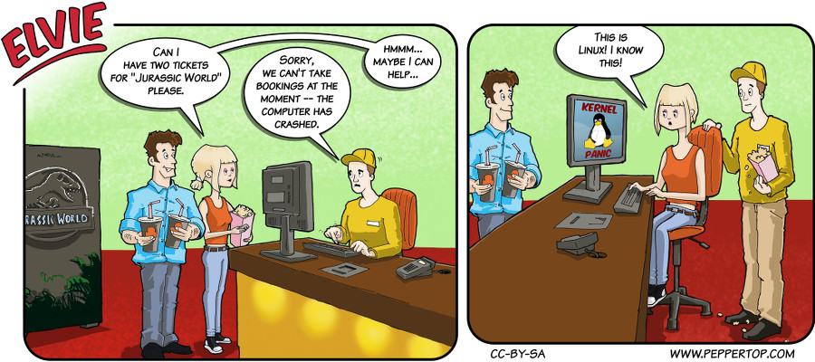

Elvie #016
==========
This strip appeared in issue #16 of Linux Voice magazine, which included an article about Linux (and Unix) in the movies,
and went on sale around the same time that Jurassic World was released.

File Details
------------
* 016_panel_n.ora             - The original MyPaint images used for the panels.
* 016_panel_n.png             - A PNG image, exported from the ORA file using The GIMP, for the main drawing in panel "n".
* 016_panel_2_friend.png      - A PNG image, exported from the ORA file for panel 1, and slightly edited for use in panel 2.
* 016_panel_2_tuxish.png      - A PNG image, hand drawn in The GIMP as a general representation of Tux, the Linux mascot.
* Elvie_016.svg               - The Inkscape SVG file that combines the panel images with frames and text to create the comic.
* Elvie_016_en-GB.jpg         - A PNG export of the final Inkscape file, converted to JPEG format for use on our website (British English).

