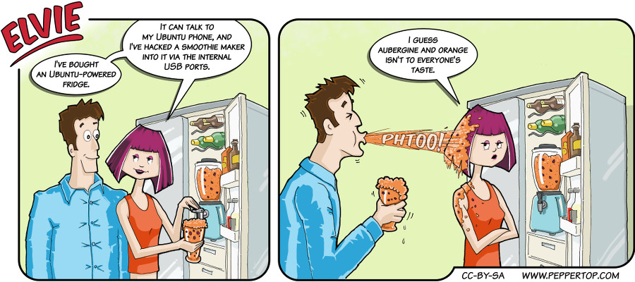

Elvie #018
==========
This strip appeared in issue #18 of Linux Voice magazine, which included a review of the Meizu MX4 Ubuntu phone,
and was published shortly after the announcement of the ChillHub Ubuntu-powered fridge
(http://www.omgubuntu.co.uk/2015/05/meet-the-smart-fridge-that-runs-ubuntu).

File Details
------------
* 018_panel_n.ora             - The original MyPaint images used for the panels.
* 018_background.ora          - The original MyPaint images used for the background and fridge.
* 018_panel_n.png             - A PNG image, exported from the ORA file using The GIMP, for the main drawing in panel "n".
* 018_background.png          - A PNG image, exported from the ORA file using The GIMP, for the background and fridge.
* Elvie_018.svg               - The Inkscape SVG file that combines the panel images with frames and text to create the comic.
* Elvie_018_en-GB.jpg         - A PNG export of the final Inkscape file, converted to JPEG format for use on our website (British English).

