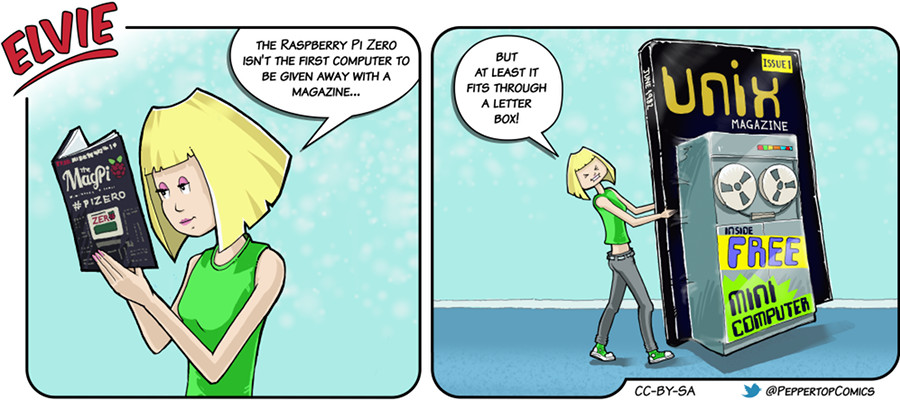

Elvie #024
==========
This strip appeared in issue #24 of Linux Voice magazine, which went to print shortly after The MagPi had released issue #40
of their magazine - the one which included a free Raspberry Pi Zero computer on the cover!

File Details
------------
* 024_panel_n.ora             - The original MyPaint images used for the panels.
* 024_panel_n.png             - A PNG image, exported from the ORA file using The GIMP, for the main drawing in panel "n".
* Elvie_024.svg               - The Inkscape SVG file that combines the panel images with frames and text to create the comic.
* Elvie_024_en-GB.jpg         - A PNG export of the final Inkscape file, converted to JPEG format for use on our website (British English).

