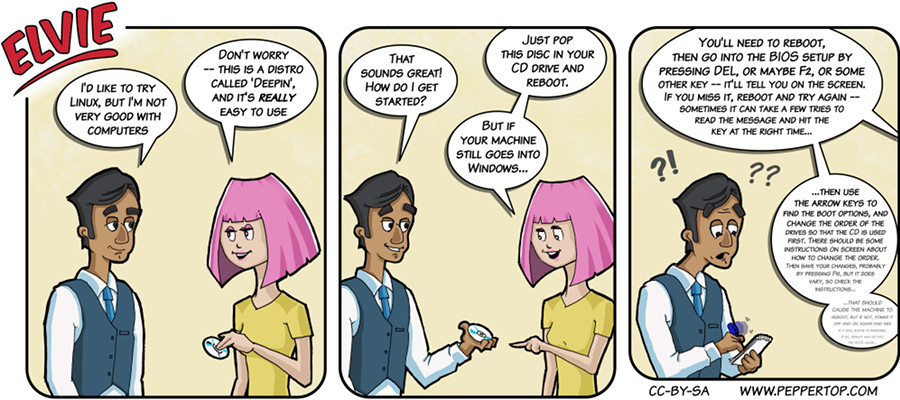

Elvie #029
==========
This strip appeared in issue #29 of Linux Voice magazine, which contained a group
test of "beginner" distros, won by Deepin.

File Details
------------
* 029_background.png         - Background image used in all panels, extracted from 029_panel_1.ora.
* 029_panel_n.ora            - The original MyPaint image used for panel "n".
* 029_panel_n.png            - A PNG image, exported from an ORA file using The GIMP, for the main drawing in panel "n".
* Elvie_029.svg              - The Inkscape SVG file that combines the panel images with frames and text to create the comic.
* Elvie_029_en-GB.jpg        - A PNG export of the final Inkscape file, converted to JPEG format for use on our website (British English).

